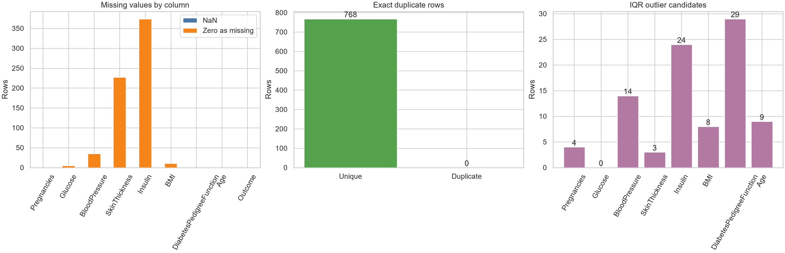
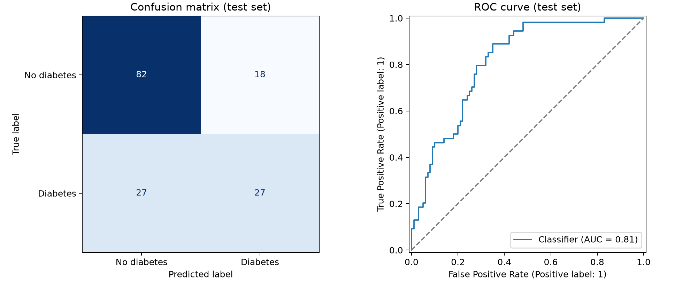

# Pima Indians Diabetes 데이터 분석 실습

2026-09-18 파이썬 데이터 분석 및 예측 모델 기초 실습입니다.

## 실행 방법

```bash
python -m pip install -r requirements.txt
python pima_data_quality.py
python pima_predict_model.py
```

두 스크립트가 `kumargh/pimaindiansdiabetescsv` 데이터를 Kaggle에서 내려받습니다. CSV에는 헤더가 없어 코드에서 9개 컬럼명을 지정합니다.

## 데이터 품질 점검

- 768행, 9열
- 원본 `NaN`: 0개, 완전 중복 행: 0개
- 결측으로 의심되는 0: Glucose 5개, BloodPressure 35개, SkinThickness 227개, Insulin 374개, BMI 11개
- 이상치 후보: 0으로 기록된 의심 결측을 제외하고 IQR 규칙으로 집계. 후보를 자동 삭제하지 않음



변수별 분포는 [상자그림](pima_analysis/outlier_boxplots.png)에서 볼 수 있습니다.

## 예측 모델

`Outcome`을 예측하는 로지스틱 회귀 모델입니다. 데이터를 80% 학습 / 20% 평가로 나누고, 양성 비율이 비슷하도록 층화 분할했습니다. 0으로 기록된 의심 결측 처리, 중앙값 대체, 표준화가 모두 모델 파이프라인에 들어 있습니다. 중앙값과 표준화 기준은 학습 데이터에서만 계산합니다.

| 평가 지표 | 값 |
| --- | ---: |
| 정확도 | 0.708 |
| 정밀도 | 0.600 |
| 재현율 | 0.500 |
| ROC AUC | 0.813 |



평가 데이터에서 실제 양성 54명 중 27명을 양성으로 예측했습니다. 이 코드는 학습용 예제이며 의료 진단에 사용하지 않습니다.

`pima_analysis/`에는 그림, 요약 CSV, 학습된 모델(`.joblib`)이 들어 있습니다. 모델 파일은 신뢰할 수 있는 출처의 파일만 불러오세요.

## 데이터 출처

- [Kaggle: Pima Indians Diabetes CSV](https://www.kaggle.com/datasets/kumargh/pimaindiansdiabetescsv)
